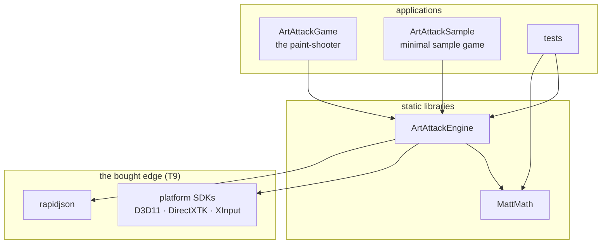

# ArtAttack — Architecture

The shape of the engine at build level: the targets, the tree, what a
module is, what a game project is, and where the engine/game boundary
runs. [PHILOSOPHY.md](PHILOSOPHY.md) holds the *why* behind every choice
here; this document is the *where things live*, and it is the
authoritative roster of modules and folders. Like the philosophies, it
describes the destination, not the current codebase.

## The targets

Three build targets plus tests, one dependency direction, one shared
compiler-settings target (see the target table in PHILOSOPHY.md).
An arrow reads "links against"; no arrow ever points the other way — an
engine file including a game header fails the build, and that is the
feature (T5).

It fails on a check and not on the compiler, and that is worth stating
plainly rather than leaving to be discovered. Includes are written from
the repository root, so an engine file says
`#include "engine/render/renderer.h"` — which means the engine's own
include root has to be the directory *above* `engine/`, and in this
repository that directory also holds `game/`. No include path admits the
first spelling and refuses `#include "game/objects/level.h"` while the
two are siblings. So `cmake/check_engine_includes.cmake` is the wall, it
runs on every build, and it fails the build with the offending file and
line. What replaces it with a compiler error is the repo split — engine
and samples in one repository, the paint-shooter in its own, consuming
the engine as a submodule — and the include roots are relative
(`CMAKE_CURRENT_SOURCE_DIR`, never `CMAKE_SOURCE_DIR`) so that split is a
move rather than a build rewrite.



The sample game is a target from the day the split lands: it is the
permanent second client that keeps the boundary honest (T1), and the
template a new project copies.

## The build

CMake, plain and boring (T4). No IDE owns the project: an engine offered
to strangers cannot require their editor, and the eventual second
platform (Targets and layout, PHILOSOPHY.md) cannot be reached from a
`.sln`.

- The root `CMakeLists.txt` declares the targets and nothing else; each
  target directory owns its own. Nothing IDE-specific is committed — a
  solution file, for whoever wants one, is generated output.
- The shared-settings job is an `INTERFACE` target every real target
  links: the language standard, `/W4`, warnings-as-errors, in exactly one
  place — so a game is compiled as strictly as the engine that hosts it
  (T5).
- The bought edge (T9) is declared, not clicked: `vcpkg.json` (manifest
  mode) names DirectXTK and the XAudio2 redistributable; header-only
  rapidjson stays vendored in `external/`.
- Tests use a portable test framework and register with CTest: `ctest`
  runs everything, on a contributor's machine or in CI, with no IDE
  present.
- Builds are out-of-source (`out/`, ignored); the source tree never
  contains build products.

Visual Studio remains a first-class way to work — it opens a CMake
folder natively, with debugging and IntelliSense intact. It just stops
being load-bearing.

## The tree

```
/
├── CMakeLists.txt          the root build file: lists the targets, nothing else
├── CMakePresets.json       the configurations: debug, release
├── vcpkg.json              the bought edge, declared (T9)
├── cmake/                  the shared settings target, helper modules
├── engine/                 the product
│   ├── math/               MattMath — depends on nothing, and links
│   │                       nothing: no DirectXTK, no D3D11, no Windows
│   ├── core/               game loop, fixed-step timing, states, services, registries
│   ├── render/             the Renderer, cameras, viewports, colours
│   │   └── d3d11/          the D3D11/DirectXTK backend, behind the Renderer
│   ├── collision/          contacts, narrow phase, manifolds, resolution
│   │                       (the pair sweep is still all-pairs; a broad
│   │                       phase goes behind find_contacts)
│   ├── scene/              Scene: the object list, the view list, the tick
│   │                       phases, the per-view draw fan-out and the cull
│   ├── input/              devices, action mapping
│   │   └── xinput/         the XInput backend
│   ├── audio/              playback, mixing
│   ├── ui/                 widgets, focus, controller navigation
│   ├── assets/             JSON loading, resource loaders, manifest, factories
│   └── app/                the application shell: window, device, services,
│                           main loop, state stack
├── game/                   the paint-shooter — first client
│   ├── states/             menu flow, gameplay flow
│   ├── objects/            entities implementing the engine interfaces
│   └── content/            the manifest, and everything it names: JSON
│                           definitions, levels, textures, sounds
├── samples/
│   └── minimal/            the second client, and the new-project template
├── tests/                  one folder per module under test
│   ├── assets/
│   ├── collision/
│   ├── core/
│   ├── input/
│   ├── math/
│   ├── render/
│   ├── scene/
│   └── ui/
├── external/               third-party source: rapidjson. DirectXTK is not
│                           here — it is a vcpkg package (vcpkg.json)
└── docs/
    ├── design/             philosophies, conventions, this document
    └── review/             findings against the current code
```

Every target directory owns its own `CMakeLists.txt`; the root file only
lists them. Every file picks its home the day it is created.
Platform-specific code
lives only in the backend subfolders (`render/d3d11/`, `input/xinput/`),
behind engine-owned interfaces, so a second platform is an addition, not
a rewrite.

Those interfaces are **concrete classes with one implementation selected
at build time, not abstract bases with vtables.** `Renderer` is declared
once in `engine/render/renderer.h`; a backend folder defines it. The two
things the seam exists for — headless tests and an eventual second
platform — are both served by build-time selection, and neither needs two
backends live in one process. A virtual call per sprite is a tax on the
frame loop that T8 does not permit, and a compile-time choice fails at
link rather than at run time (T5). Promoting a concrete class to an
interface later is mechanical and changes no call site, so that option is
held, not spent — the same escalation as promoting a folder to a library.

## Modules

A module is a folder inside `engine/`, not a build target. The walls
between modules are include discipline — every include names its module
(`#include "engine/collision/narrow_phase.h"`, see
[CONVENTIONS.md](CONVENTIONS.md)) — and review enforces the direction
below. If a wall ever needs to be load-bearing, the escalation path is
known and cheap: promote the folder to a static library, as MattMath
already is (T5). That option is held, not spent.

| Module | May depend on |
|---|---|
| `math` | nothing — and it links nothing, which is what makes this true |
| `core` | math |
| `collision` | core, math |
| `render` | core, math — D3D11/DirectXTK inside `d3d11/` only |
| `scene` | core, math, collision, render |
| `input` | core, math — XInput inside `xinput/` only |
| `audio` | core, math — the audio backend at its edge only |
| `ui` | core, math, render, input |
| `assets` | core, math, render, audio, rapidjson |
| `app` | everything |

Dependencies point one way — toward `math` — and never sideways in a
cycle. `core` is the only module everything may lean on. Three modules
lean on peers, for the same kind of reason: `ui`, because widgets
genuinely are rendering plus input; `scene`, because a scene genuinely is
an object list plus a sweep plus a fan-out; and `assets`, because a loader
has to know what it is building.

`Scene` is why `scene` is a folder and not a file in `core/`. The review
filed it as `core/scene.*`, written before `collision/` existed. It cannot
go there: a scene owns collision objects and sweeps them, and `collision`
depends on `core`, so `core → collision` would close a cycle — and it
drives the renderer, which `core → math` does not allow. Both walls are
real, and a module is a folder, so the cheap answer is the right one.

Nothing points back at `assets`, and that is what keeps its arrows from
closing into a cycle. Resource types are passive: a sprite sheet is
handed its frame table and a sound bank its effect instances, already
parsed. No type on the draw path reads a file, so `rapidjson` reaches
`assets` and stops there — drawing a sprite does not compile a JSON
parser. It is a `SYSTEM PRIVATE` include on the engine, and that is now
literally true rather than nearly true: `assets/json.h` hands out
`JsonDocument` and `JsonValue`, whose only rapidjson is a `void*`
recovered inside `json.cpp`, so no engine header names the parser and no
client needs it to include one. `tests/assets` used to ask for rapidjson
on its own account and no longer does, which is the check. The game still
does, for one reason that will not go away: the save file is the one JSON
this project *writes*, and `assets` only reads.

`JsonValue` is also the module's answer to a question every loader had
answered separately, or not at all. rapidjson's accessors assert on a
missing key or a wrong type, `NDEBUG` disarms the assert, and content
files are the one input a person types by hand — so an unchecked read is
a stopped debug build and a null dereference in a shipped one. Every
accessor on `JsonValue` checks, and throws naming the file and the
position in it (`'./levels/turbulence.json': collision_objects[17] has no
'colour'`), which is T6 applied to the input most likely to be wrong.
`where()` hands the same position to a caller with its own reason to
reject what it read — an unknown colour name is a content mistake exactly
like a missing key.

**One backend still lives outside its folder, and it is named here rather
than left to be discovered.** `assets/resource_loader.cpp` creates
textures and fonts on a device, so it includes
`render/d3d11/backend.h` and spells `DDSTextureLoader` and `SpriteFont`
directly. That is the resource factory's job and not the renderer's — a
`Renderer` that could load a file from disk would be a worse seam — but it
does mean a second backend is three translation units, not one, and that
the third of them is in `assets/`. `app/application.cpp` is the only other
file outside `render/d3d11/` that includes it, because a window handle and
a swap chain belong to a platform and the shell owns both. A third would
be a mistake.

`app` sits at the top and is the one module allowed to depend on all of
them, because assembling them is the whole of its job: it opens the
window, creates the device, constructs every service once, runs the loop
and owns the state stack. Nothing in the engine may point back at it —
that is the rule that keeps "depends on everything" from meaning "cycle
with everything", and it is what lets a game link the engine and use as
little of `app` as it likes.

## A game project

For readers arriving from Unreal, the translation:

| Unreal | ArtAttack |
|---|---|
| Project (`.uproject`) | a folder: a short `CMakeLists.txt`, a `main.cpp`, a `content/` directory |
| Module (`Build.cs`) | an engine folder with a fixed dependency direction — users don't write modules |
| Plugin | none. Mechanisms enter the engine by design (T1), not through a plugin registry |
| Content browser + `.uasset` | `content/`: plain JSON and standard formats, walked by the manifest (T7) |
| Blueprint | C++ against the engine API (T10) |

A project is an ordinary C++ application that links two static
libraries. There is no project file format, no code generation, no
module manifest — the `CMakeLists.txt` is a dozen honest lines. Starting
a game is copying `samples/minimal/`, renaming the target, and owning
everything inside — including the starter code the
sample exists to hand over (see Structural types in PHILOSOPHY.md).

Its anatomy is the sample's anatomy:

- **`main.cpp`** — constructs the application shell, hands it the first
  state.
- **states** — the game's flow: menus, gameplay. The engine runs the
  state machine; the states are the game's.
- **objects** — types implementing `GameObject` / `CollisionObject` at
  whatever granularity the game chooses.
- **`content/`** — definitions, levels, tuning, assets. Data says *which*
  and *how much*; the code says *how* (T7).
- **the shared settings target** — linked like everyone else's, so a
  game is compiled exactly as strictly as the engine that hosts it (T5).

## The boundary

The engine provides mechanism; the game provides policy (T1). They meet
at a seam made of three small interfaces and of data the engine routes
but never interprets. Engine headers contain no game nouns; the litmus
test lives in PHILOSOPHY.md (The boundary).

```mermaid
flowchart LR
    subgraph ENGINE["the engine — mechanism"]
        scene["Scene, game loop,<br/>fixed-step timing"]
        collision["collision detection<br/>and response"]
        render["renderer, cameras,<br/>viewports, split-screen"]
        input["input devices,<br/>action mapping"]
        audio["audio playback<br/>and mixing"]
        assets["asset loading,<br/>registries, JSON"]
        states["state machinery"]
        widgets["widgets, focus,<br/>navigation"]
    end
    subgraph SEAM["the seam"]
        interfaces["small interfaces<br/>GameObject · CollisionObject · State"]
        data["uninterpreted data<br/>layers and masks · opaque tags<br/>string keys · spawn groups"]
    end
    subgraph GAME["the game — policy"]
        match["the match: rounds,<br/>win conditions, scoring"]
        meaning["what collides with what,<br/>and what a hit means"]
        drawn["what is drawn: sprites,<br/>HUD, menu content"]
        actions["which actions exist,<br/>and their bindings"]
        sounds["which sounds play,<br/>and when"]
        content["the content: definitions,<br/>levels, tuning"]
        flow["the states: menu flow,<br/>gameplay flow"]
    end
    ENGINE --- SEAM --- GAME
```



Everything the game is — to the engine — is a set of states plus
content. There is no `IGame` to implement, no engine `Player`, `Level`,
`Match` or `Team` (Structural types, PHILOSOPHY.md): the boundary is not
just where the code splits, it is where the vocabulary splits.
