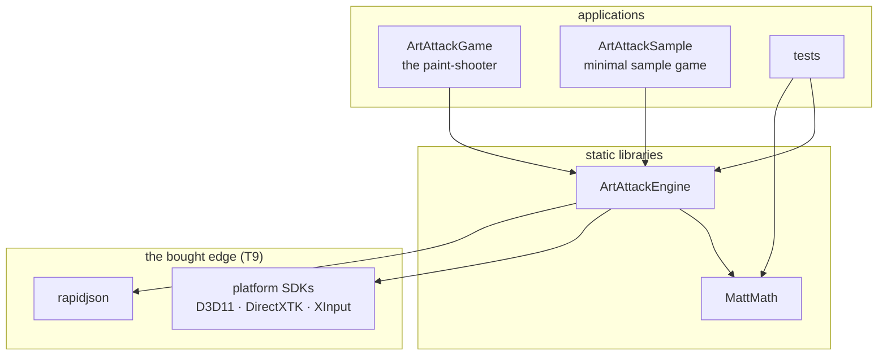

# ArtAttack — Architecture

The shape of the engine at build level: the targets, the tree, what a
module is, what a game project is, and where the engine/game boundary
runs. [PHILOSOPHY.md](PHILOSOPHY.md) holds the *why* behind every choice
here; this document is the *where things live*, and it is the
authoritative roster of modules and folders. Like the philosophies, it
describes the destination, not the current codebase.

## The targets

Three build targets plus tests, one dependency direction, one shared
compiler-settings target (see the target table in PHILOSOPHY.md).
An arrow reads "links against"; no arrow ever points the other way — an
engine file including a game header fails the build, and that is the
feature (T5).

It fails on the compiler *and* on a check, and the difference between
the two is worth stating plainly rather than leaving to be discovered.
Includes are written from the repository root, so an engine file says
`#include "engine/render/renderer.h"` — which means the engine's own
include root has to be the directory *above* `engine/`. That directory
used to hold `game/` too, and no include path admits the first spelling
and refuses `#include "game/objects/level.h"` while the two are
siblings; `cmake/check_engine_includes.cmake` was the whole of the wall
for exactly as long as that was true. The repo split ended it. The
paint-shooter is in its own repository consuming this one as a submodule,
nothing named `game/` sits beside `engine/` any more, and the offending
include now fails like any other missing header:

```
engine\scene\scene.cpp(1): fatal error C1083: Cannot open include file:
'game/objects/level.h': No such file or directory
```

The check stays anyway, and not out of sentiment. The compiler only
enforces the rule when this repository is built **standalone**. A client
consuming the engine as a subdirectory builds it from a tree that very
likely does have a `game/` in it, and that client's include roots are not
the engine's business — there, the grep is the only thing holding the
line. It runs on every build and fails with the offending file and line.



The sample game is a target from the day the split lands: it is the
permanent second client that keeps the boundary honest (T1), and the
template a new project copies.

## The build

CMake, plain and boring (T4). No IDE owns the project: an engine offered
to strangers cannot require their editor, and the eventual second
platform (Targets and layout, PHILOSOPHY.md) cannot be reached from a
`.sln`.

- The root `CMakeLists.txt` declares the targets and nothing else; each
  target directory owns its own. Nothing IDE-specific is committed — a
  solution file, for whoever wants one, is generated output.
- The shared-settings job is an `INTERFACE` target every real target
  links: the language standard, `/W4`, warnings-as-errors, in exactly one
  place — so a game is compiled as strictly as the engine that hosts it
  (T5).
- The bought edge (T9) is declared, not clicked: `vcpkg.json` (manifest
  mode) names DirectXTK and the XAudio2 redistributable; header-only
  rapidjson stays vendored in `external/`.
- Tests use a portable test framework and register with CTest: `ctest`
  runs everything, on a contributor's machine or in CI, with no IDE
  present. CI is `.github/workflows/ci.yml` - debug and release, configure,
  build and test, on a runner with no wave bank, which is what a fresh clone
  gets.
- Benchmarks register with CTest too, and assert on complexity class rather
  than on wall-clock: a phase that is linear in the object count must stay
  linear when the count quadruples, whatever the machine. An absolute
  threshold would either fail on a slow box or pass on a fast one after a
  real regression.
- Builds are out-of-source (`out/`, ignored); the source tree never
  contains build products.

Visual Studio remains a first-class way to work — it opens a CMake
folder natively, with debugging and IntelliSense intact. It just stops
being load-bearing.

## The tree

```
/
├── CMakeLists.txt          the root build file: lists the targets, nothing else
├── CMakePresets.json       the configurations: debug, release
├── vcpkg.json              the bought edge, declared (T9)
├── cmake/                  the shared settings target, helper modules
├── engine/                 the product
│   ├── math/               MattMath — depends on nothing, and links
│   │                       nothing: no DirectXTK, no D3D11, no Windows
│   ├── core/               game loop, fixed-step timing, states, services,
│   │                       registries, reading numbers out of a file
│   ├── render/             the Renderer, cameras, viewports, colours, fonts
│   │   └── d3d11/          the D3D11/DirectXTK backend, behind the Renderer
│   ├── collision/          contacts, narrow phase, manifolds, resolution
│   │                       (the pair sweep is still all-pairs; a broad
│   │                       phase goes behind find_contacts)
│   ├── scene/              Scene: the object list, the view list, the tick
│   │                       phases, the per-view draw fan-out and the cull
│   ├── input/              devices: polling, deadzones, press edges, typed
│   │                       text. Three devices, one API shape, two ways in
│   │                       — the pads are read from a backend, the keyboard
│   │                       and mouse are fed from the window (see below).
│   │                       The action map is deliberately not built -
│   │                       neither client has a rebinding screen, so a
│   │                       binding table would be a speculative framework
│   │                       (T1)
│   │   └── xinput/         the XInput backend. There is no win32/ beside
│   │                       it: the keyboard and mouse have no backend to
│   │                       select, because their platform edge is the
│   │                       window and it already exists
│   ├── audio/              playback, mixing
│   ├── ui/                 widgets, focus, controller navigation
│   ├── assets/             JSON loading, resource loaders, manifest, factories
│   └── app/                the application shell: window, device, services,
│                           main loop, state stack
├── samples/               two clients, answering two different questions
│   ├── minimal/            the new-project template: the smallest thing
│                           that runs, and the one you copy. The
│                           paint-shooter that used to sit beside it under
│                           game/ is its own repository now, and consumes
│                           this one as a submodule
│   └── linesweeper/        a whole game, and the one you read. Three
│       ├── rules/          layers: rules/ links nothing, so the game is
│       ├── presentation/   playable from tests/ with no device;
│       └── states/         presentation/ reads a world and draws it; and
│                           states/ is the only place that includes both
│                           rules/ and engine/. Its own README records the
│                           decisions behind it
├── tests/                  one folder per module under test, plus the one
│   ├── app/                sample that has rules to assert on
│   ├── assets/
│   ├── collision/
│   ├── core/
│   ├── input/
│   ├── linesweeper/        the falling-block game, played headless: this
│   ├── math/               target links LineSweeperRules and no engine
│   ├── render/
│   ├── scene/
│   └── ui/
├── bench/                  throughput, registered with ctest beside the tests
├── external/               third-party source: rapidjson. DirectXTK is not
│                           here — it is a vcpkg package (vcpkg.json)
├── .github/workflows/      CI
└── docs/
    ├── design/             philosophies, conventions, this document
    ├── repo-split.md       the verified procedure for splitting engine from game
    └── review/             findings against the current code
```

Every target directory owns its own `CMakeLists.txt`; the root file only
lists them. Every file picks its home the day it is created.
Platform-specific code
lives only in the backend subfolders (`render/d3d11/`, `input/xinput/`),
behind engine-owned interfaces, so a second platform is an addition, not
a rewrite. There is a third case and it is named here rather than left to
be discovered: the shell's window, `app/window.{h,cpp}`. `app` is already
the one module allowed to depend on everything, PHILOSOPHY lists
windowing alongside the rendering backend as platform code at the edge,
and the seam is the same shape as the others — `Window` translates
messages and `WindowNotify` is what the owner implements, so nothing
above it names a Win32 type. It is not in `app/win32/` because there is
no second platform to select between and inventing the folder now is the
speculative framework T1 rules out; when one arrives the pair moves down
a folder without renaming the class or touching a call site.

That third case now carries two of the three input devices, and the
asymmetry is worth stating because it looks like an inconsistency and is
not. A gamepad is **read**: `input/xinput/` asks XInput for a complete
snapshot whenever `Gamepads::poll` wants one, and owes the window
nothing. A keyboard and a mouse are **fed**: they reach a Win32 program
only as messages in a window's queue, and one of their channels — typed
text — cannot be rebuilt from device state at any price, because the
shift resolution, the key repeat, the dead keys and the IME have all
happened inside the OS before the character exists. The wheel is the same
shape for a different reason: it has no position to sample, only deltas
that are gone if nobody was listening.

So the flow for those two is `app → input`, never the reverse. `Window`
translates the messages into `Key` and `MouseButton` — the engine's own
names, so nothing above `window.cpp` meets a `VK_` constant or a UTF-16
code unit — `WindowNotify` carries them out, `Application` forwards them
into the devices, and the devices latch them into frames. The module
table is untouched by all of it: `input` still depends on `core` and
`math` alone, and nothing in it knows a window exists.

What a game sees is the same shape for all three devices — `state`,
`previous_state`, `held`, `pressed`, `released`, and an edge that
requires the device to have been live on both frames. That last rule is
`gamepad.h`'s, transplanted: a pad that was unplugged and a window that
lost the foreground produce the identical phantom press, and a client
should not have to learn two spellings to suppress one bug.

Those interfaces are **concrete classes with one implementation selected
at build time, not abstract bases with vtables.** `Renderer` is declared
once in `engine/render/renderer.h`; a backend folder defines it. The two
things the seam exists for — headless tests and an eventual second
platform — are both served by build-time selection, and neither needs two
backends live in one process. A virtual call per sprite is a tax on the
frame loop that T8 does not permit, and a compile-time choice fails at
link rather than at run time (T5). Promoting a concrete class to an
interface later is mechanical and changes no call site, so that option is
held, not spent — the same escalation as promoting a folder to a library.

## Modules

A module is a folder inside `engine/`, not a build target. The walls
between modules are include discipline — every include names its module
(`#include "engine/collision/narrow_phase.h"`, see
[CONVENTIONS.md](CONVENTIONS.md)) — and review enforces the direction
below. If a wall ever needs to be load-bearing, the escalation path is
known and cheap: promote the folder to a static library, as MattMath
already is (T5). That option is held, not spent.

| Module | May depend on |
|---|---|
| `math` | nothing — and it links nothing, which is what makes this true |
| `core` | math |
| `collision` | core, math |
| `render` | core, math — D3D11/DirectXTK inside `d3d11/` only |
| `scene` | core, math, collision, render |
| `input` | core, math — XInput inside `xinput/` only |
| `audio` | core, math — the audio backend at its edge only |
| `ui` | core, math, render, input |
| `assets` | core, math, render, audio, rapidjson |
| `app` | everything |

Dependencies point one way — toward `math` — and never sideways in a
cycle. `core` is the only module everything may lean on. Three modules
lean on peers, for the same kind of reason: `ui`, because widgets
genuinely are rendering plus input; `scene`, because a scene genuinely is
an object list plus a sweep plus a fan-out; and `assets`, because a loader
has to know what it is building.

`Scene` is why `scene` is a folder and not a file in `core/`. The review
filed it as `core/scene.*`, written before `collision/` existed. It cannot
go there: a scene owns collision objects and sweeps them, and `collision`
depends on `core`, so `core → collision` would close a cycle — and it
drives the renderer, which `core → math` does not allow. Both walls are
real, and a module is a folder, so the cheap answer is the right one.

Nothing points back at `assets`, and that is what keeps its arrows from
closing into a cycle. Resource types are passive: a sprite sheet is
handed its frame table and a sound bank its effect instances, already
parsed. No type on the draw path reads a file, so `rapidjson` reaches
`assets` and stops there — drawing a sprite does not compile a JSON
parser. It is a `SYSTEM PRIVATE` include on the engine, and that is now
literally true rather than nearly true: `assets/json.h` hands out
`JsonDocument` and `JsonValue`, whose only rapidjson is a `void*`
recovered inside `json.cpp`, so no engine header names the parser and no
client needs it to include one. `tests/assets` used to ask for rapidjson
on its own account and no longer does, which is the check. The game still
does, for one reason that will not go away: the save file is the one JSON
this project *writes*, and `assets` only reads.

`JsonValue` is also the module's answer to a question every loader had
answered separately, or not at all. rapidjson's accessors assert on a
missing key or a wrong type, `NDEBUG` disarms the assert, and content
files are the one input a person types by hand — so an unchecked read is
a stopped debug build and a null dereference in a shipped one. Every
accessor on `JsonValue` checks, and throws naming the file and the
position in it (`'./levels/turbulence.json': collision_objects[17] has no
'colour'`), which is T6 applied to the input most likely to be wrong.
`where()` hands the same position to a caller with its own reason to
reject what it read — an unknown colour name is a content mistake exactly
like a missing key.

**The backend is three translation units, and all three are in its folder.**
A second backend supplies `renderer.cpp`, `render_resources.cpp` and
`resource_factory.cpp`. The third is there because creating a texture from a
file is the resource factory's job and not the renderer's — a `Renderer`
that could load a file from disk would be a worse seam — while every line of
that job names a graphics type, so it belongs to the backend even though
none of its callers do. `assets/` declares which manifest entries become
textures and fonts and calls `render/resource_factory.h`, whose declarations
name nothing a backend owns.

**No file outside `render/<backend>/` includes the backend header, and
`cmake/check_engine_includes.cmake` fails the build for one that does.** The
shell is not an exception to that: it passes its window handle to
`Renderer::create_device` as a `void*`, because a window handle is not a
graphics type — it is this platform's window, and the backend casts it back.

The rule is about *any* file, and it is worth saying because it was once
written as a count of implementation files. Counted that way it missed the
include that carried the backend furthest: `assets/resource_loader.h` named
`ID3D11Device1` in a constructor, and `app/application.h` includes it, so
`<d3d11_1.h>` reached every state file in every client without anyone
choosing that. A header carries a backend further in one line than a
translation unit can, so the check reads both — and being a check rather than
a paragraph is the point (T5).

**The shell asks the machine exactly one question, once, and what the
answer sizes is one thing.** `ApplicationOptions::max_threads` defaults to
the logical-processor count and sizes the thread pool. It does not size
anything else, and it used to size two other things: the renderer's view
capacity and — through `ThreadPool::max_num_threads` — the partition
count. Those are three questions with three different right answers. A
pool's ceiling is a property of the machine; a view capacity is a property
of the *layout*, four for split-screen and one for a sample, on any
machine; a partition count is a property of the work. The conflation was
not untidy but expensive, because view capacity is what sizes the per-view
recording state before a frame starts, and on an integrated GPU that state
comes out of the same memory the game runs in.

`app` sits at the top and is the one module allowed to depend on all of
them, because assembling them is the whole of its job: it opens the
window, creates the device, constructs every service once, runs the loop
and owns the state stack. Nothing in the engine may point back at it —
that is the rule that keeps "depends on everything" from meaning "cycle
with everything", and it is what lets a game link the engine and use as
little of `app` as it likes.

## A game project

For readers arriving from Unreal, the translation:

| Unreal | ArtAttack |
|---|---|
| Project (`.uproject`) | a folder: a short `CMakeLists.txt`, a `main.cpp`, a `content/` directory |
| Module (`Build.cs`) | an engine folder with a fixed dependency direction — users don't write modules |
| Plugin | none. Mechanisms enter the engine by design (T1), not through a plugin registry |
| Content browser + `.uasset` | `content/`: plain JSON and standard formats, walked by the manifest (T7) |
| Blueprint | C++ against the engine API (T10) |

A project is an ordinary C++ application that links two static
libraries. There is no project file format, no code generation, no
module manifest — the `CMakeLists.txt` is a dozen honest lines. Starting
a game is copying `samples/minimal/`, renaming the target, and owning
everything inside — including the starter code the
sample exists to hand over (see Structural types in PHILOSOPHY.md).

Its anatomy is the sample's anatomy:

- **`main.cpp`** — constructs the application shell, hands it the first
  state.
- **states** — the game's flow: menus, gameplay. The engine runs the
  state machine; the states are the game's.
- **objects** — types implementing `GameObject` / `CollisionObject` at
  whatever granularity the game chooses.
- **`content/`** — definitions, levels, tuning, assets. Data says *which*
  and *how much*; the code says *how* (T7).
- **the shared settings target** — linked like everyone else's, so a
  game is compiled exactly as strictly as the engine that hosts it (T5).

## The boundary

The engine provides mechanism; the game provides policy (T1). They meet
at a seam made of three small interfaces and of data the engine routes
but never interprets. Engine headers contain no game nouns; the litmus
test lives in PHILOSOPHY.md (The boundary).

```mermaid
flowchart LR
    subgraph ENGINE["the engine — mechanism"]
        scene["Scene, game loop,<br/>fixed-step timing"]
        collision["collision detection<br/>and response"]
        render["renderer, cameras,<br/>viewports, split-screen"]
        input["input devices:<br/>polling, deadzones, edges"]
        audio["audio playback<br/>and mixing"]
        assets["asset loading,<br/>registries, JSON"]
        states["state machinery"]
        widgets["widgets, focus,<br/>navigation"]
    end
    subgraph SEAM["the seam"]
        interfaces["small interfaces<br/>GameObject · CollisionObject · State"]
        data["uninterpreted data<br/>layers and masks · opaque tags<br/>string keys · spawn groups"]
    end
    subgraph GAME["the game — policy"]
        match["the match: rounds,<br/>win conditions, scoring"]
        meaning["what collides with what,<br/>and what a hit means"]
        drawn["what is drawn: sprites,<br/>HUD, menu content"]
        actions["which actions exist,<br/>and their bindings"]
        sounds["which sounds play,<br/>and when"]
        content["the content: definitions,<br/>levels, tuning"]
        flow["the states: menu flow,<br/>gameplay flow"]
    end
    ENGINE --- SEAM --- GAME
```



Everything the game is — to the engine — is a set of states plus
content. There is no `IGame` to implement, no engine `Player`, `Level`,
`Match` or `Team` (Structural types, PHILOSOPHY.md): the boundary is not
just where the code splits, it is where the vocabulary splits.
