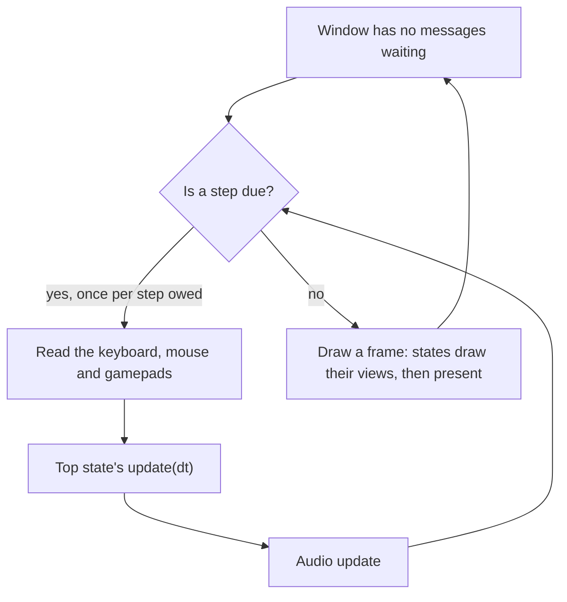

import SourceFile from '~/components/SourceFile.astro';
import RepoLink from '~/components/RepoLink.astro';

A Labrador game advances in **fixed steps** and draws in **frames**. The two are separate:
the simulation steps at the rate the game asks for, sixty times a second by default, and a frame
is drawn whenever the window is free to draw one. This page follows one pass through the loop
from the top.

## The step

`ApplicationOptions::target_fps` sets the step, and the engine's clock runs `update` as many times
as wall-clock time says are owed. Usually that is once per frame. After a slow frame it is
several times in a row, at full speed, before the next frame is drawn. At most a tenth of a
second is ever owed at once, so a game paused in a debugger does not run a minute of updates when
it resumes.

Because the step is fixed, the `dt` passed to every `update` is the same value: 1/60 of a second
at the default. Write movement against `dt` all the same, as the minimal sample does, so the code
does not depend on the rate. A game whose rules must be exact can count steps instead.
LineSweeper does: every duration in its rules is a number of ticks, and its `main.cpp` sets
`target_fps` to 60 as a rule of the game, not a preference.

When your game blocks on purpose (loading a level, say), call `app.reset_elapsed_time()`
afterwards. Otherwise the time spent loading is owed as steps, and the next frame runs them all
on a world nobody has seen yet.

## Input is read first

Each step begins by reading every input device, before any state's `update` runs. A "pressed"
answer therefore means *down now, and not down at the last step*, measured across the same
boundary for every device: a key and a gamepad button pressed together report together. A key
pressed and released between two steps is not seen at all, which at sixty steps a second no
person can do. The input devices are services you borrow from the application, and you ask them
questions during `update`; the [input guide](/docs/guides/input/) covers them.

## A scene's four phases

Inside the top state's `update`, a state that owns a [`Scene`](/docs/reference/scene/scene/)
steps it in four phases, in this order:

1. **`scene->update(dt)`** steps every object once: collision objects first, then the rest.
2. **`scene->resolve()`** finds every overlapping pair of collision objects and tells both
   participants, through `on_contact`. The list of contacts stays readable from
   `scene->contacts()` until the end of the tick, so a game or a test can see what touched what.
3. **Your own phase**, if you need one: anything that depends on where the contacts left things,
   such as moving a held item to follow a body a contact just pushed. The engine has no function
   for this. Write a loop between `resolve()` and `end_tick()`.
4. **`scene->end_tick()`** applies everything that waited for the tick to be over. Collision
   objects outside the scene's bounds, if it has bounds, are flagged for deletion; every flagged
   collision object is destroyed; and every object added during the tick joins the scene.

A game with no collision skips phases 2 and 3. That is both samples, and this is LineSweeper's
whole play-state update after its pause and restart checks:

<SourceFile
	path="samples/linesweeper/states/play_state.cpp"
	from="this->last_tick_ = tick(this->world_, this->gate_.pass(this->read_input()));"
	to="this->scene_->end_tick();"
/>

`tick()` is the game's own rules, a function in the sample that steps the match by exactly one
step. The scene then steps the objects that draw it.

### Why adds wait for the end of the tick

[`Scene::add`](/docs/reference/scene/scene/#add) gives you a pointer to the new object straight
away, but the object does not join the scene until `end_tick()`. Objects are added in the middle
of a tick: a weapon fires, a piece spawns. If the add went straight into the list the scene is
walking, it could invalidate that walk. Waiting also means an object added this tick is first
collided with on the next one, so a shot does not hit something on the frame it leaves the
barrel.

The same rule explains a line both samples have after filling their scene in `init()`:

<SourceFile path="samples/minimal/states/hello_state.cpp" from="// Every add is pending until a tick ends" to="this->scene_->end_tick();" />

### What is removed, and when

A collision object leaves the scene at the end of the tick in which something called
`set_for_deletion(true)` on it, or in which it left the scene's bounds. The pointer `add` returned
stops being valid then. A plain `GameObject` is never removed on its own: it stays until the scene
is destroyed, so a game keeps short-lived visual effects either as collision objects or, as
LineSweeper does with its particles, inside one long-lived object.

## Then a frame is drawn

After the steps that were owed, the engine draws one frame: it begins the frame, asks the states
to draw (from the topmost state that covers the screen upward, as
[States and the stack](/docs/concepts/states/#what-a-covered-state-sees) describes), submits what
they recorded, and presents. Nothing is drawn before the first step has run.

Drawing reads what the steps wrote and changes nothing. That rule is what makes the frame safe to
draw on several threads at once, and it is the subject of the next page.

Next: [Drawing, views and cameras](/docs/concepts/drawing/).
